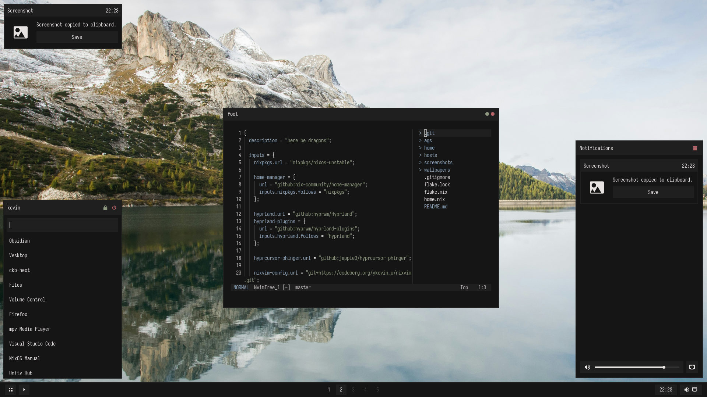

# Flaky Scalp

## Inspo & Credits

- [chadcat7](https://github.com/chadcat7)
  - https://nam.is-a.dev/blog/ricing/
  - https://github.com/chadcat7/crystal
- [Aylur](https://github.com/Aylur) for making ags and his configs
- [Manas140](https://github.com/Manas140) for the paradise colorscheme & his neovim config

## TODO

- [x] Refactor ags styles to incorporate scss mixins
- [ ] Figure out qt theming (low priority)
- [ ] Change widget layout for better compatibility (horizontal bottom bar)
